# SolarOps - UI Screen Catalog (Visual)

> Live visual map. Auto-generated by `solarflow-dashboard/scripts/capture-screens.mjs` (run via `/snap-ui` or on deploy). Do not hand-edit screenshots; edit `scripts/ui-screens.manifest.json` and re-run.

_Last captured: 2026-06-10 - 21/22 screens - viewport 1440x900_

Text-only routing reference: [UI_UX_SCREEN_MAP.md](UI_UX_SCREEN_MAP.md)

## Contents

- **Authentication & Onboarding**: [Staff Login](#staff-login) / [Forgot Password](#forgot-password) / [Reset Password](#reset-password) / [Contractor Login](#contractor-login)
- **Staff App (admin role)**: [Ops Center](#dispatch) / [Dashboard](#dashboard) / [Customers](#customers) / [Lead Lobby](#lobby) / [SolarEdge Sites](#solaredge) / [Work Orders](#jobs) / [Dispatch Map](#routes) / [RMA Tracker](#rma) / [Billing](#billing) / [Contractor Pay](#contractor-billing) / [Service Rates](#rates) / [Contractors](#contractors) / [New Install](#projects) / [Inventory](#inventory) / [Settings](#settings)
- **Sales Role**: [Sales CRM](#crm) / [Clients (Sales)](#customers2)
- **Contractor Portal**: [Contractor Dashboard](#my-jobs)

---

# Authentication & Onboarding

## Staff Login

- **id:** `staff-login` (pre-login)
- **Macro:** Staff portal sign-in.
- **Detail:** LoginScreen. Email/password, Face ID/passkey button, Forgot password, Contractor Portal link.

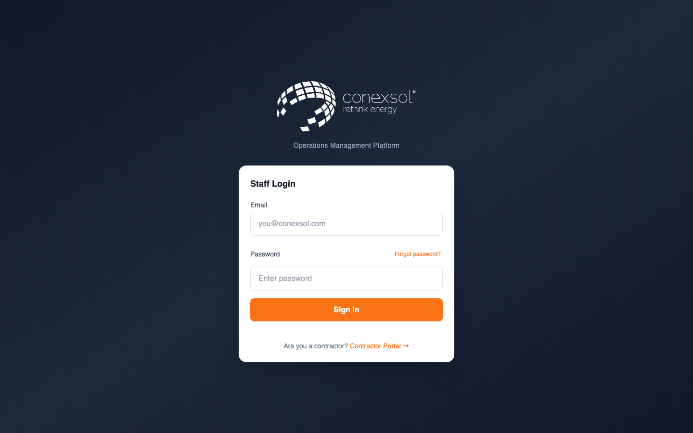

---

## Forgot Password

- **id:** `forgot-password` (pre-login)
- **Macro:** Password reset request.
- **Detail:** LoginScreen showForgot state. Email input, sends reset link.

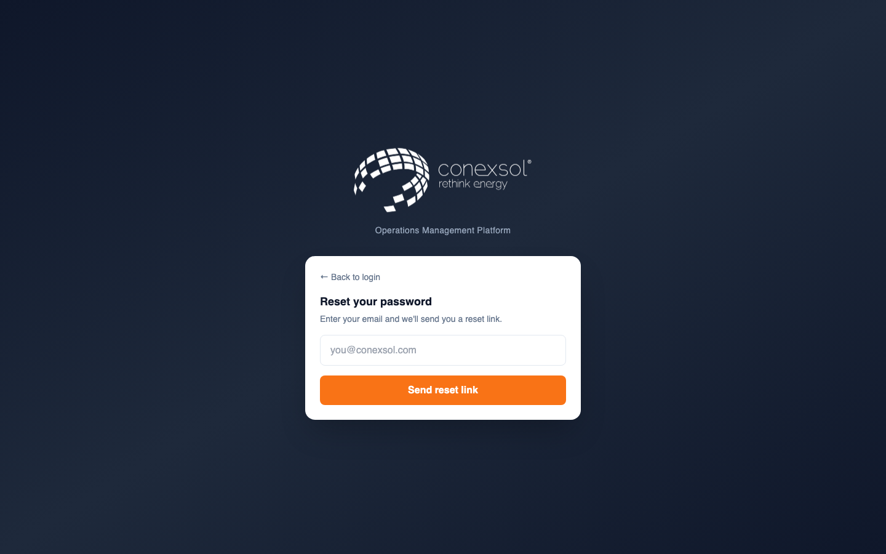

---

## Reset Password

- **id:** `reset-password` (pre-login)
- **Macro:** Set a new password from email link.
- **Detail:** ResetPasswordScreen. New + confirm password; verifies recovery token first.

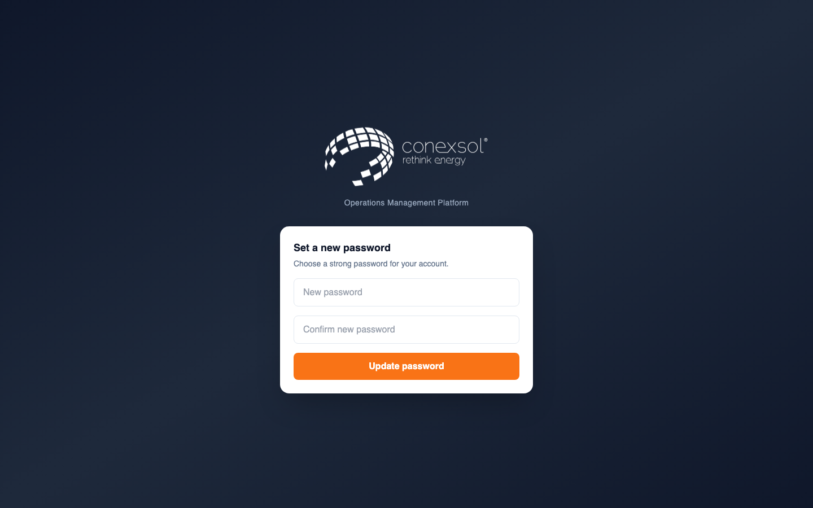

---

## Contractor Login

- **id:** `contractor-login` (pre-login)
- **Macro:** Contractor portal sign-in.
- **Detail:** ContractorLoginScreen. Separate auth from staff; register link.

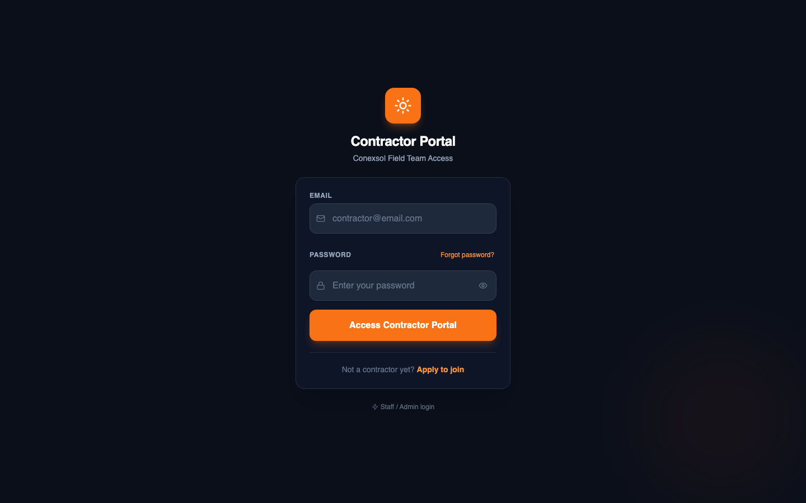

---

# Staff App (admin role)

## Ops Center

- **id:** `dispatch` (view `dispatch`)
- **Macro:** Dispatch command center: 4-widget operational overview.
- **Detail:** DispatchDashboard. Live work-order queue, technician status, alerts, today's schedule.

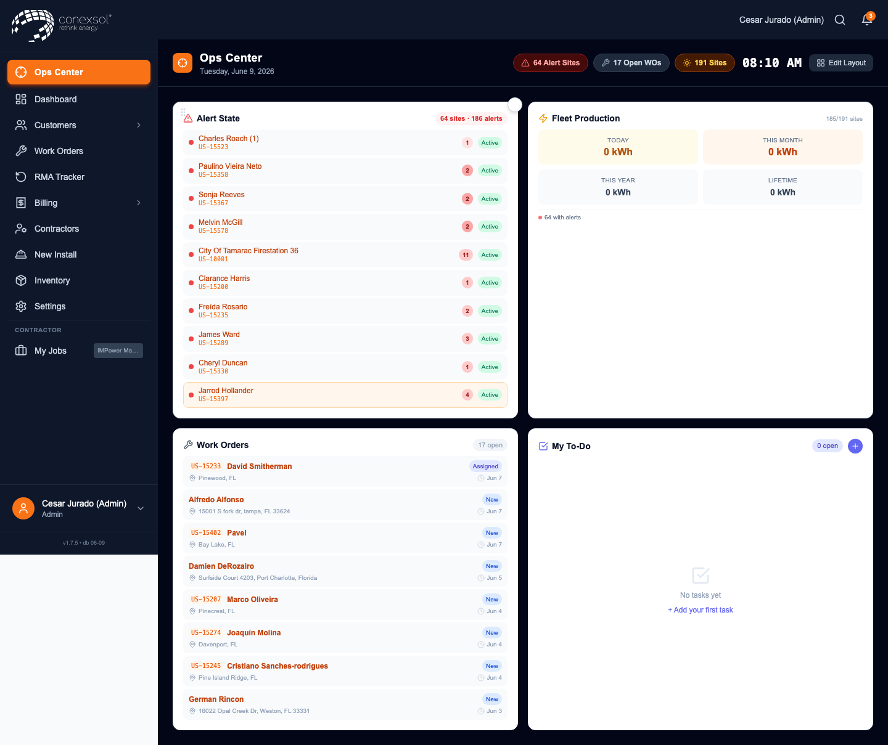

---

## Dashboard

- **id:** `dashboard` (view `dashboard`)
- **Macro:** Home KPIs and activity overview.
- **Detail:** Dashboard. Revenue/job KPIs, charts, recent activity, quick links.

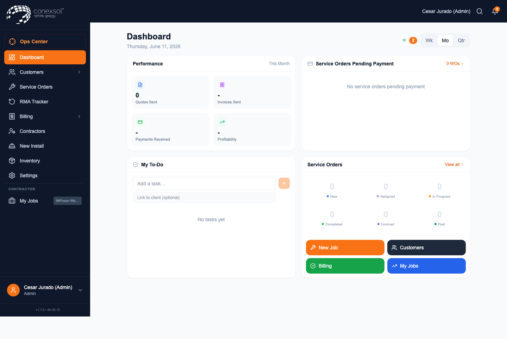

---

## Customers

- **id:** `customers` (view `customers`)
- **Macro:** 360 customer directory and detail.
- **Detail:** Customers. Search, customer cards, interaction history, links to SolarEdge sites and jobs.

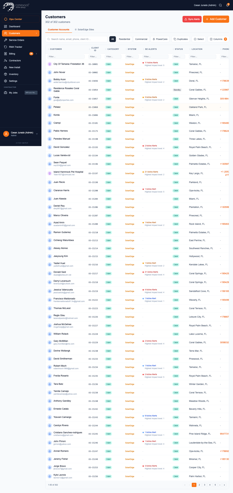

---

## Lead Lobby

- **id:** `lobby` (view `lobby`)
- **Macro:** Inbound lead intake and triage.
- **Detail:** LeadLobby. Lead pipeline, assignment, conversion to customer/job.

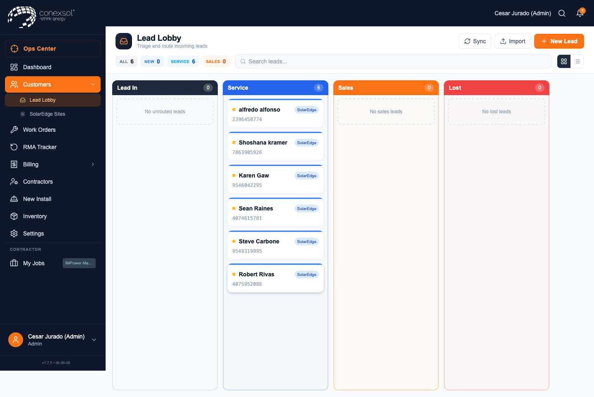

---

## SolarEdge Sites

- **id:** `solaredge` (view `solaredge`)
- **Macro:** SolarEdge monitoring sites grid.
- **Detail:** SolarEdgeMonitoring. Site list, power/energy columns (MonitoringColumnPicker), SiteProfilePanel on click, import modal.

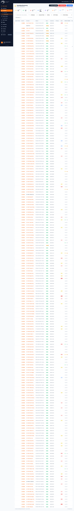

---

## Work Orders

- **id:** `jobs` (view `jobs`)
- **Macro:** Work-order list and pipeline.
- **Detail:** Jobs. Status filters, work-order rows, opens WorkOrderPanel / jobDetail. WorkOrderCalendar for scheduling.

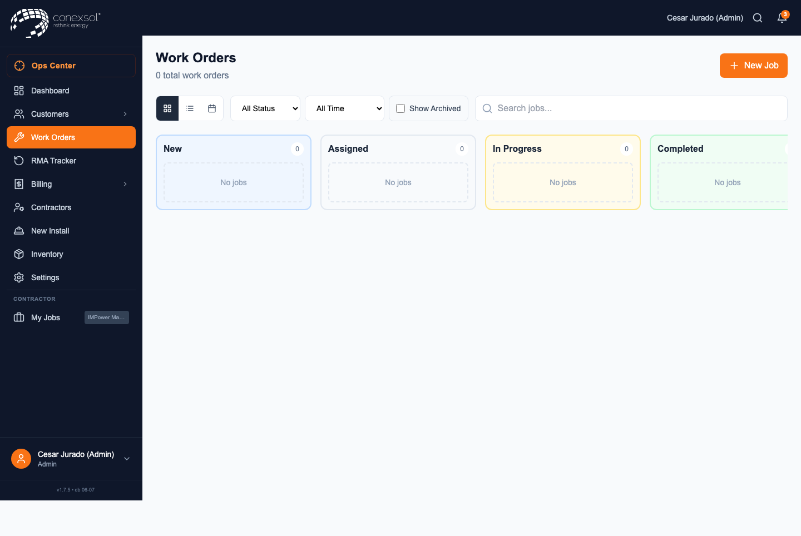

---

## Dispatch Map

- **id:** `routes` (view `routes`)
- **Macro:** All active work orders plotted on a map.
- **Detail:** DispatchMap. Geocodes WO addresses (OSM/Nominatim) and plots colored pins + schedule-order route panel. Foundation for agentic route optimization (Google Maps Routes API).

_(capture failed: page.reload: Timeout 30000ms exceeded.
Call log:
  - waiting for navigation until "networkidle"
    - navigated to "http://localhost:5173/"
)_

---

## RMA Tracker

- **id:** `rma` (view `rma`)
- **Macro:** Return-merchandise-authorization tracking.
- **Detail:** RMADashboard. RMA entries, status, RmaCreateModal.

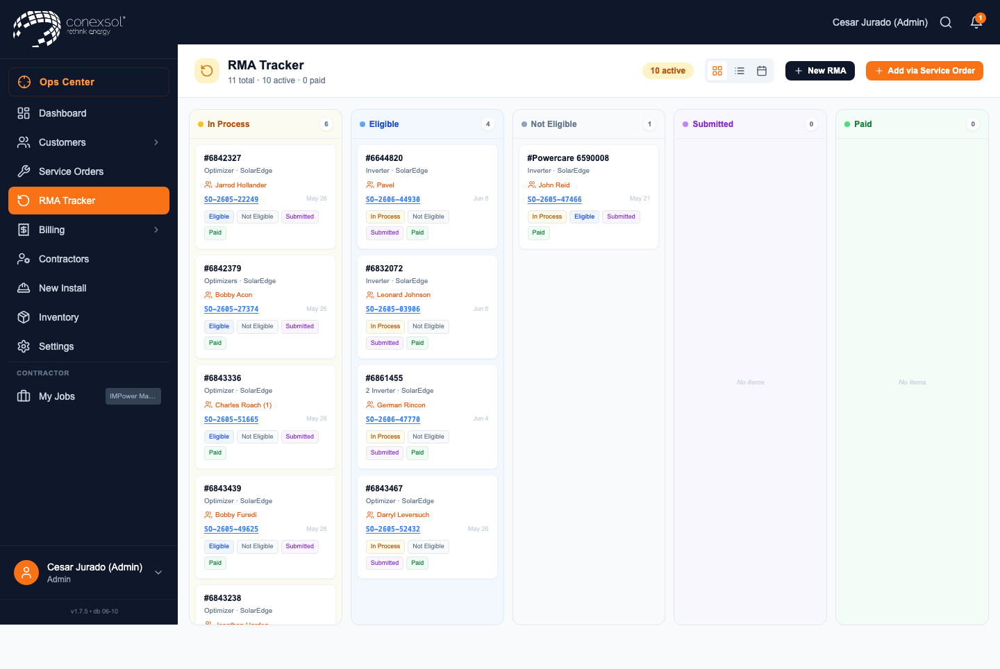

---

## Billing

- **id:** `billing` (view `billing`)
- **Macro:** Invoices, payments, profitability.
- **Detail:** Billing. Unbilled badge, invoice creation, BillingReportModal, Xero integration.

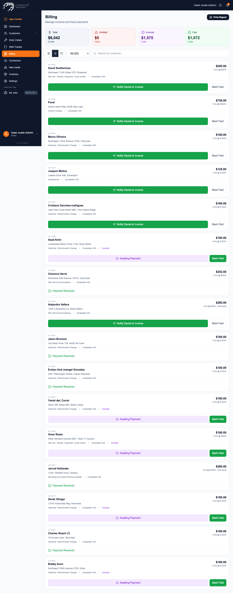

---

## Contractor Pay

- **id:** `contractor-billing` (view `contractor-billing`)
- **Macro:** Contractor payout / billing module.
- **Detail:** admin/BillingModule. Contractor invoices, approval, pay status.

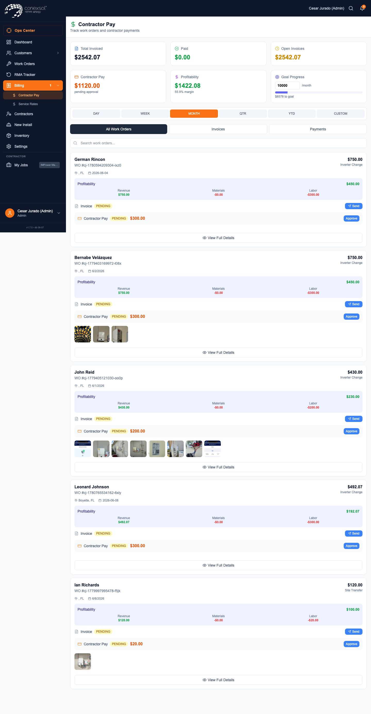

---

## Service Rates

- **id:** `rates` (view `rates`)
- **Macro:** Service rate management.
- **Detail:** contractor/RateManagement. Rate cards per service type.

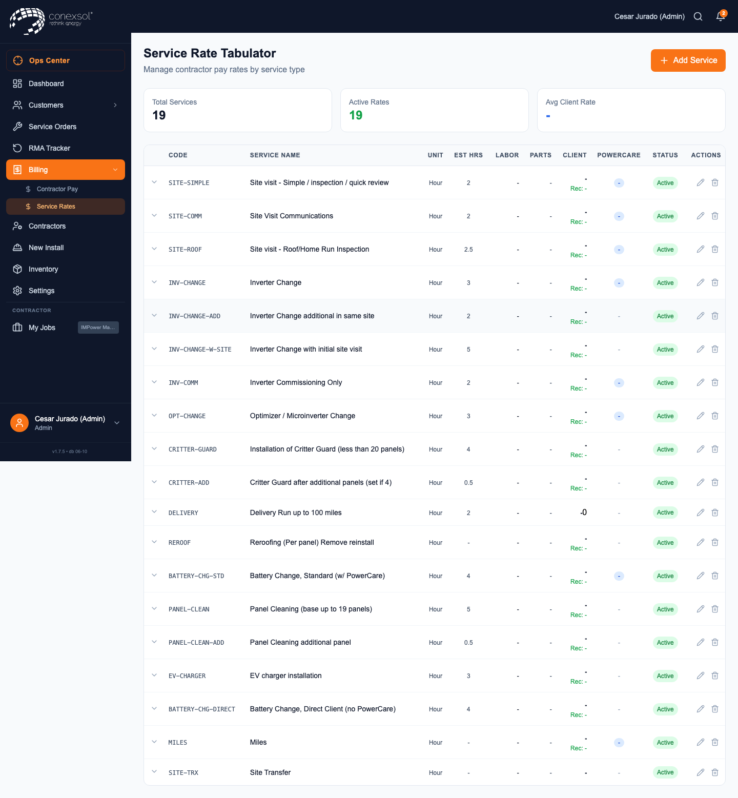

---

## Contractors

- **id:** `contractors` (view `contractors`)
- **Macro:** Contractor roster and approvals.
- **Detail:** contractor/ContractorApprovals. Onboarding review, approve/reject, profile edit.

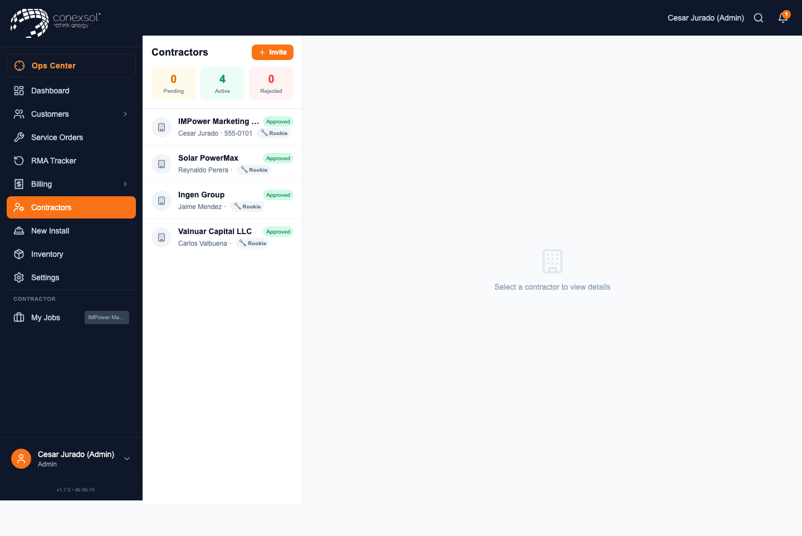

---

## New Install

- **id:** `projects` (view `projects`)
- **Macro:** New solar installation projects.
- **Detail:** SolarProjects. Project list, ProjectInstallationSection, ProjectPartsSection.

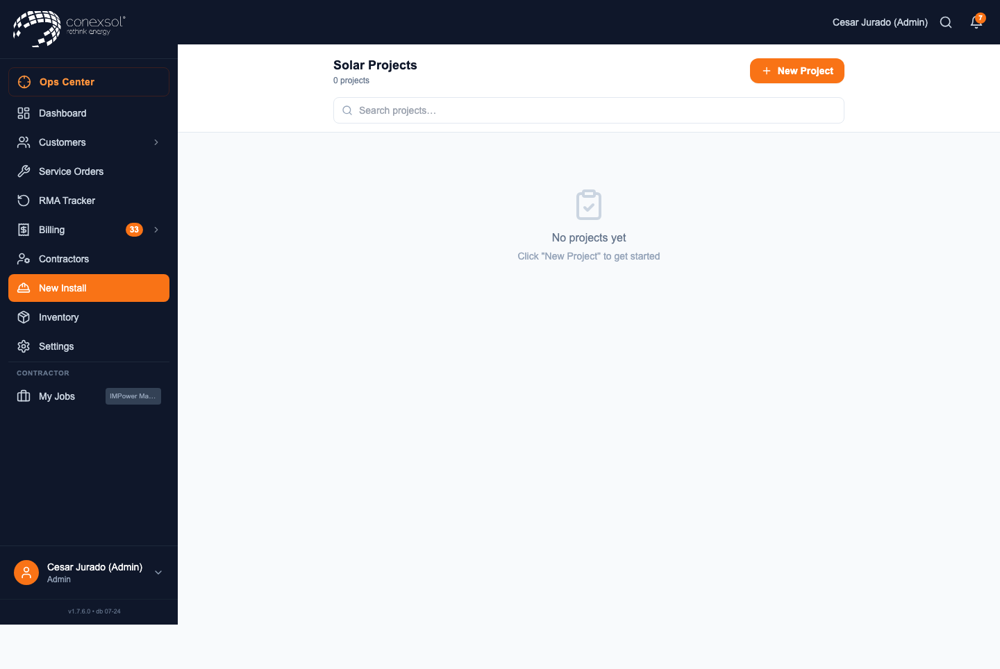

---

## Inventory

- **id:** `inventory` (view `inventory`)
- **Macro:** Equipment, tools, providers, receiving.
- **Detail:** InventoryModule. Stock, receive form (warehouse field), receiving history, providers.

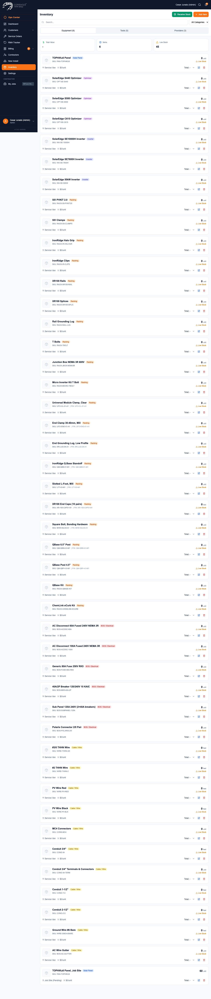

---

## Settings

- **id:** `settings` (view `settings`)
- **Macro:** Admin settings and user management.
- **Detail:** Settings. UserPermissionsPanel, UserActivityLog, LogViewer, PhotoCleanupCard.

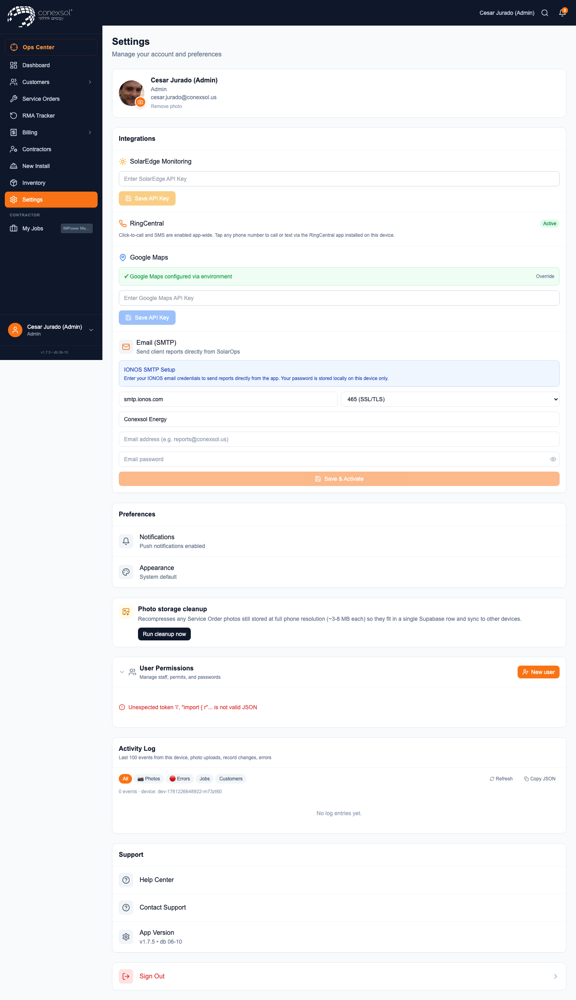

---

# Sales Role

## Sales CRM

- **id:** `crm` (view `crm`)
- **Macro:** Gamified sales lead pipeline.
- **Detail:** CRMDashboard. XP/levels/leaderboard, lead stages, activity logging. (sales role nav)

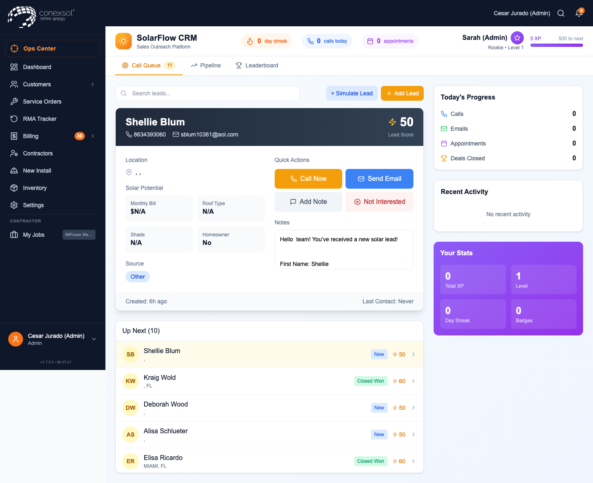

---

## Clients (Sales)

- **id:** `customers2` (view `customers2`)
- **Macro:** Sales-side client management.
- **Detail:** CustomerManagement. Client 360, interactions (calls/emails/SMS/notes/meetings). (sales role nav)

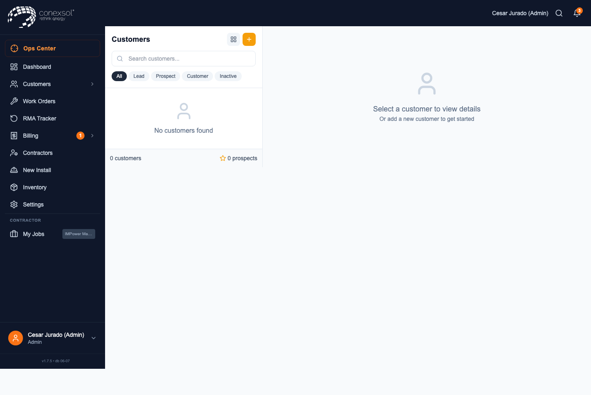

---

# Contractor Portal

## Contractor Dashboard

- **id:** `my-jobs` (view `my-jobs`)
- **Macro:** Contractor / dual-role job list.
- **Detail:** ContractorDashboard. Timeframe tabs (Day/Week/Month/YTD), status chips (All/Queue/En Route/In Progress/Completed/On Hold); opens contractor JobDetail. Note: contractors who have not accepted the agreement first see the ConexSolTerms gate (shown in this capture).

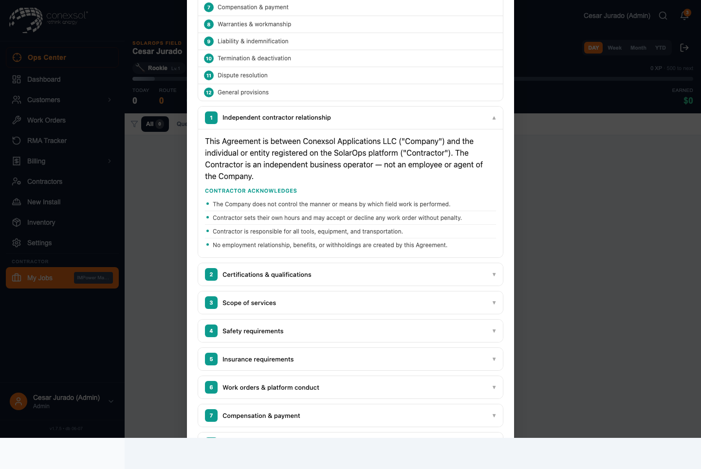

---

